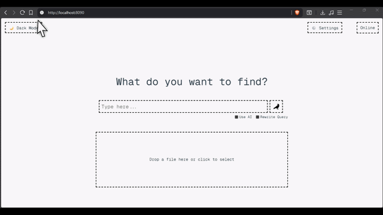

<div align="center">

<h1>Lodestone</h1>


<p>Lodestone is a local-first document retrieval system. Drop in files, query with natural language, get answers grounded in your documents. Everything runs on your machine.</p>



</div>

---

## Quickstart

The easiest way to install and run Lodestone is using the automated install script.

**Prerequisites**: Docker

**Windows (PowerShell)**:
```powershell
iwr "https://raw.githubusercontent.com/bremsstrahlung-57/lodestone/master/install.ps1" -OutFile "$env:TEMP\install.ps1"; powershell -ExecutionPolicy Bypass -File "$env:TEMP\install.ps1"
```

**macOS/Linux (Bash)**:
```bash
curl -sSL https://raw.githubusercontent.com/bremsstrahlung-57/lodestone/master/install.sh | bash
```

Open `http://localhost:8090`. Add your API key in Settings, drop in a file, and search.

---

## CLI Commands

The install script automatically installs the `lodestone` CLI wrapper to `~/.local/bin` for easily managing your local instance:

- `lodestone start` — Start the Lodestone containers
- `lodestone stop` — Stop the Lodestone containers
- `lodestone update` — Fetch latest configurations and CLI wrapper, pull new Docker images, and restart
- `lodestone logs` — Tail the container logs
- `lodestone delete` — Stop containers and remove local images (keeps data and volumes)
- `lodestone prune` — Completely wipe containers, images, volumes, and installation data (keeps user config)

---

## Features

- Semantic search over your own documents using sentence embeddings
- AI-answered queries with retrieved context as grounding
- Drag-and-drop file ingestion from the browser
- Full document viewer with expandable neighboring chunks
- Switchable LLM providers: Anthropic, OpenAI, Gemini, Groq
- Content-addressed deduplication via SHA3-256

---

## How It Works

Ingested documents are chunked, embedded with MiniLM-L6-v2, and stored in a local Qdrant instance. Queries go through optional AI rewriting, dense vector search, cross-encoder reranking, and score-based filtering before results are returned. Full document content is cached in SQLite. Everything is async end-to-end.

---

## Stack

| Layer | Technology |
|---|---|
| Frontend | React + Vite |
| Backend | FastAPI |
| Vector store | Qdrant (local via Docker) |
| Metadata store | SQLite via aiosqlite |
| Embeddings | MiniLM-L6-v2 |
| Reranking | Cross-encoder |
| LLM providers | Anthropic, OpenAI, Gemini, Groq |

---

## Local Development

If you want to run Lodestone from source for development:

**Prerequisites**: Python 3.12+, Node.js, Docker

```bash
# Start Qdrant
docker run -p 8092:6333 qdrant/qdrant

# Backend
cd backend
pip install -r requirements.txt
uvicorn main:app --reload --port 8091

# Frontend
cd frontend
npm install
npm run dev
```

---

## Configuration

Lodestone follows the XDG base directory spec. On first run, config files are created at:

- `~/.config/lodestone/config.toml` — general settings and defaults
- `~/.config/lodestone/keys.toml` — API keys, gitignored by default

---
